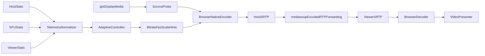

# Native-resolution screen-sharing roadmap

## Feasibility verdict

The central product is feasible, with important limits:

- Feasible: one AV1-or-H.264 screen-video stream through mediasoup, no simulcast, arbitrary captured dimensions, dynamic bitrate/FPS ceilings, resolution-first hints, NACK/RTX recovery, cross-browser telemetry, and an application adaptation state machine. Select AV1 from the end-to-end capability intersection and fall back to H.264 packetization mode 1. The current mediasoup worker rejects H.265, so H.265 remains detected but unroutable rather than a claimed fallback.
- Best effort, not guaranteed: physical/native-pixel capture, full source FPS, exact bitrate utilization, hardware encoding, exact H.264 profile, or the requested degradation order. The browser and OS retain final control.
- Not exposed by standard WebRTC: direct H.264 quantizer/QP setting, video-FEC percentage, RTX timing, GOP/keyframe interval, exact jitter-buffer depth, exact stale-frame eviction, or replacement of the browser congestion controller. `qpSum` is observational only, and mediasoup does not implement video RED/ULPFEC/FlexFEC.
- Quantization does not downscale. It compresses the existing pixel grid more heavily. Emergency spatial reduction must use a scale factor derived from the actual source dimensions, such as 3024×1964, rather than a named 1080p/4K preset.
- “Use all host upload” is not the correct safety target through an SFU. With one non-layered stream, useful bitrate is bounded by the minimum of host→SFU capacity, SFU→viewer capacity, receiver capability, and configured ceiling. Excess host bitrate cannot be converted by mediasoup and creates loss/queues instead of quality.
- No simulcast is appropriate for one viewer. With heterogeneous future viewers, all viewers must accept the same encoded stream; the weakest path either drives the host encoder or performs poorly. That is the decision point for simulcast/SVC or transcoding.
- mediasoup terminates DTLS-SRTP separately on each leg and can inspect/rewrite RTP/RTCP, but it does not decode, resize, filter, or re-encode H.264. This is not media-payload end-to-end encryption.
- “Redundancy” in the baseline means hop-local RTX/NACK plus bitrate headroom. Duplicate video streams, multipath WebRTC, and app-controlled video FEC are outside the feasible portable baseline.

## Architecture and repository boundaries

Use a TypeScript Bun workspace with a minimal React/Vite client, a Hono-on-Bun signaling and future mediasoup server, WebSocket signaling, runtime-validated shared messages, pure controller logic, and JSONL telemetry artifacts:

- [apps/web](apps/web): capture, sender policy, mediasoup client, receiver presentation, and live statistics for both roles.
- [apps/sfu](apps/sfu): room/role lifecycle, signaling, mediasoup workers/routers/transports, and server telemetry.
- [packages/protocol](packages/protocol): versioned signaling and telemetry schemas.
- [packages/adaptation](packages/adaptation): deterministic estimator, quality policy, state machine, and replay tests.
- [packages/telemetry](packages/telemetry): browser/server stat normalization and percentile calculations.
- [packages/test-fixtures](packages/test-fixtures): text/motion/frame-ID source pages and latency markers.
- [tests/network](tests/network): repeatable controller traces, impairment profiles, and scenario definitions.
- [infra](infra): HTTPS, announced-address, and TURN examples; no production deployment yet.

The controller must not pretend to replace WebRTC bandwidth estimation. It combines host-uplink, SFU egress, and viewer evidence into guardrails and sends decisions back to the host over signaling.

## Delivery protocol

Implement only one stage per development pass, run its gate, preserve its telemetry artifacts, and stop for review. Approval of this roadmap authorizes only Stage 0; later stages remain separate follow-up tasks.

## Stage 0 — contracts and scaffolding

Create the monorepo boundaries, lint/typecheck/test commands, HTTPS development configuration, typed room messages, telemetry envelopes, controller input/output types, browser capability flags, and deterministic fixture specifications. Keep the UI to host/viewer role selection, room code, share/stop, a video element, and a collapsed live-statistics placeholder available to both roles.

Controller output should expose only portable intent: `targetVideoBitrateBps`, `maxFramerate`, `scaleResolutionDownBy`, `contentMode`, controller state, reason, and hold time. Replace the proposed controllable “FEC budget” with observable `repairHeadroomBps`; it reserves capacity but does not claim browser FEC control.

Gate: clean install, typecheck, unit tests, schema round trips, one-command client/server startup, and documented browser/OS prerequisites. No media connection yet.

## Stage 1 — capture-fidelity laboratory

Implement capture independently of mediasoup in [apps/web/src/capture](apps/web/src/capture):

- Call `getDisplayMedia({ video: true, audio: false })` only from user activation.
- Inspect `getCapabilities()` and `getSettings()` after selection; request capability maxima and the host FPS ceiling with `applyConstraints()`, then re-read actual settings.
- Keep source, encoded, decoded, and CSS/render dimensions as distinct fields.
- Feature-detect `contentHint`; support `detail`, `motion`, and `auto`, with `auto` initially selecting a declared default rather than an unvalidated classifier.
- Render direct local preview without canvas scaling and handle picker cancel, permission denial, and track ending.

Gate on real Chrome, Firefox, and Safari: record actual arbitrary source dimensions/FPS, preserve aspect ratio, stop cleanly, and produce a capability report. Do not fail merely because an OS/browser reports a lower capture mode; make the limitation explicit.

## Stage 2 — pristine mediasoup path

Implement one host producer and one viewer consumer with separate send/receive `WebRtcTransport`s, UDP first and TCP fallback. Exchange browser send/receive codec capabilities and select from the end-to-end intersection: AV1 first, then H.265 only if the SFU can route it, then H.264 packetization mode 1. Configure compatible H.264 profile-level negotiation from actual browser capabilities; do not assume a particular hardware encoder or silently claim a fixed profile. Enable RTX/NACK where negotiated. Do not add simulcast RIDs, SVC, audio, data channels, recording, or transcoding.

Gate all nine sender→viewer combinations among current desktop Chrome, Firefox, and Safari: the highest shared SFU-routable codec is negotiated (with a forced H.264 fallback check), first frame renders, source/outbound/inbound dimensions are logged, stop/refresh/rejoin works, and a 15-minute clean-network soak has no unrecovered stall. At least 1080p30 is the common qualification tier; higher native modes are capability-characterization tiers because 3024×1964@60 cannot be guaranteed on every browser/device.

## Stage 3 — measurement before adaptation

Implement normalized one-second samples plus immediate lifecycle events in [packages/telemetry](packages/telemetry). Treat optional stats as absent, never zero. Correlate source, outbound RTP, mediasoup producer/consumer/transport, inbound RTP, and `requestVideoFrameCallback()` counters.

Expose the normalized data in a live statistics panel for both host and viewer. Each role sees its local measurements plus a signaling-forwarded peer summary: codec, source/encoded/decoded/render dimensions, capture/encode/presentation FPS, target/actual bitrate, RTT, jitter, loss, NACK/RTX, QP when available, frame drops, freezes, estimated latency, and controller state. Render unsupported values as “Unavailable” and do not expose ICE addresses or other network identifiers.

Measure:

- Capture/encode/send/decode/render dimensions and FPS.
- Actual bitrate, RTT/minimum RTT/trend, jitter, loss, NACK/RTX, PLI/FIR, encode/decode time, QP where present, quality limitation reason, freezes, and frame cadence variance.
- Estimated capture-to-compositor latency from browser metadata where available.
- Test-fixture latency using a visible frame ID/timestamp and clock-offset estimation. Keep an external high-speed-camera test as the glass-to-glass ground truth.

Gate: stable schemas across all nine browser pairings, counter reset/SSRC change handling, P50/P95/P99 reports, correctly updating host/viewer statistics panels, and no controller actions. Establish per-browser clean-network baselines before setting hard latency SLOs; use provisional lab targets of P50 ≤250 ms and P95 ≤500 ms only as investigation thresholds.

## Stage 4 — manual encoder actuation and quality curves

Add a diagnostics-only control surface for `maxBitrate`, `maxFramerate`, `degradationPreference = "maintain-resolution"`, `scaleResolutionDownBy = 1`, and content mode. Read parameters back and verify behavior from stats rather than assuming support.

Run progressive bitrate-cap sweeps at fixed actual capture resolution and fixed requested FPS in Chrome, Firefox, and Safari. Record encoded resolution/FPS, actual bitrate, QP where available, frame drops, freezes, and any browser-initiated spatial or temporal adaptation. Compare received frames perceptually against known deterministic test patterns and retain structured human-inspection notes. Derive browser/codec-specific soft and hard quality thresholds from this evidence; do not use OCR.

Major decision gate: lowering the ceiling must change bitrate measurably, native dimensions must remain stable where the browser honors resolution priority, and unsupported or ignored controls must be captured in a capability matrix. Do not finalize Stage 5 thresholds, state transitions, or FPS ladders until these experiments establish how each browser actually behaves. If a browser violates compression-before-FPS at fixed settings, adapt the policy to that observed limitation rather than hiding it.

## Stage 5 — adaptive controller, replay first

Implement [packages/adaptation](packages/adaptation) as pure, deterministic logic with `probing`, `stabilizing`, `backoff`, `recovery`, and `emergency` states:

- Safe transport budget = conservative minimum of host-uplink evidence and viewer/SFU-leg evidence, minus protocol/RTX headroom.
- Detect likely queue growth from RTT inflation relative to a rolling minimum; combine it with loss, send rate, viewer freezes, and encoder limitation signals. Label congestion-vs-random-loss classification as heuristic.
- Apply fast bitrate backoff, slow additive recovery, minimum hold times, and stronger evidence for upgrades than downgrades.
- Preserve scale 1.0; increase compression by lowering the bitrate ceiling first. Reduce FPS only after sustained hard-quality or queue pressure, using a configurable ladder. Permit spatial reduction only after a practical minimum FPS and a separate sustained emergency timer.
- Log every input snapshot, decision, reason, and rejected transition.

Validate recorded replays and synthetic step/ramp/oscillation traces before shadow mode, then compare shadow decisions with observed WebRTC behavior before enabling actuation.

Gate: deterministic replay tests, no oscillation under a steady path, bounded backoff after a capacity drop, cautious recovery, and no spatial action outside emergency state.

## Stage 6 — loss recovery and freshness

Keep mediasoup/browser RTX/NACK enabled and hop-local. Reserve retransmission headroom in the source-video cap, but do not claim control of RTX deadlines or FEC. Rate-limit application keyframe requests and issue them only after a diagnosed decode stall or join/recovery event.

Feature-detect receiver jitter-buffer targeting and test a shallow preference only where supported. Native `<video>` remains the presentation path; `requestVideoFrameCallback()` observes cadence/freezes but cannot portably delete individual stale frames from the browser jitter buffer.

Test bandwidth, RTT, random loss, burst loss, jitter, reorder, and step recovery with available OS-native, router, or hosted network-conditioning tools. Bandwidth measurement comes from normalized browser and mediasoup statistics; there is no Linux-specific measurement or impairment-gateway requirement. Keep synthetic traces for deterministic controller replay even when live-network conditioning is manual.

Gate: RTX counters rise under repairable loss, keyframe requests remain bounded, freezes recover, queueing latency does not grow without bound, and random-loss behavior does not inject extra traffic as if it were congestion-controlled FEC.

## Stage 7 — emergency arbitrary-resolution scaling

Only now add spatial fallback. Compute scale ratios from current captured width/height and a policy pixel budget; never branch on labels such as 4K or 1080p. Prefer `RTCRtpSender.setParameters().scaleResolutionDownBy`; use a tested `applyConstraints()` fallback only where sender scaling is ineffective. Restore native scale after longer, stronger recovery evidence than was required to downscale.

Gate: no resolution change before the emergency conditions, aspect ratio stays intact, scale changes do not require a session restart, and recovery to the actual source dimensions has no oscillation.

## Stage 8 — compatibility and pathological-network qualification

Qualify current and previous stable desktop browsers on supported macOS/Windows/Linux combinations, direct UDP, TURN/UDP, and TURN/TCP/TLS. Test picker cancellation, source ending, backgrounding, display sleep, ICE restart, network handoff, CPU pressure, long soaks, and abrupt capacity changes. Real Safari/SafariDriver plus assisted manual capture is required; Playwright WebKit is not Safari qualification.

Gate: published capability/limitation matrix, retained telemetry artifacts for every scenario, 30-minute clean and impaired soaks, and no unsupported optional API causing session failure.

## Deferred experiments and decision gates

After the baseline passes, independently evaluate H.264 profiles/levels and encoder implementations, Encoded Transform instrumentation/E2EE, WebCodecs in a separate transport prototype, content classification, and alternative codecs. Do not put any of these on the critical path.

Revisit no-simulcast only when a second simultaneous viewer with a materially different path must be supported. Revisit WebRTC itself only if direct QP, deterministic playout, or multipath redundancy becomes a hard requirement, because those goals require owning substantially more of the media stack.

## Primary references

- [W3C Screen Capture](https://www.w3.org/TR/screen-capture/)
- [WebRTC Statistics](https://www.w3.org/TR/webrtc-stats/)
- [RTCRtpSender parameters](https://developer.mozilla.org/en-US/docs/Web/API/RTCRtpSender/setParameters)
- [mediasoup v3 API](https://mediasoup.org/documentation/v3/mediasoup/api/)
- [mediasoup RTP capabilities](https://mediasoup.org/documentation/v3/mediasoup/rtp-parameters-and-capabilities/)
- [WebRTC Encoded Transform](https://www.w3.org/TR/2026/WD-webrtc-encoded-transform-20260416/)
